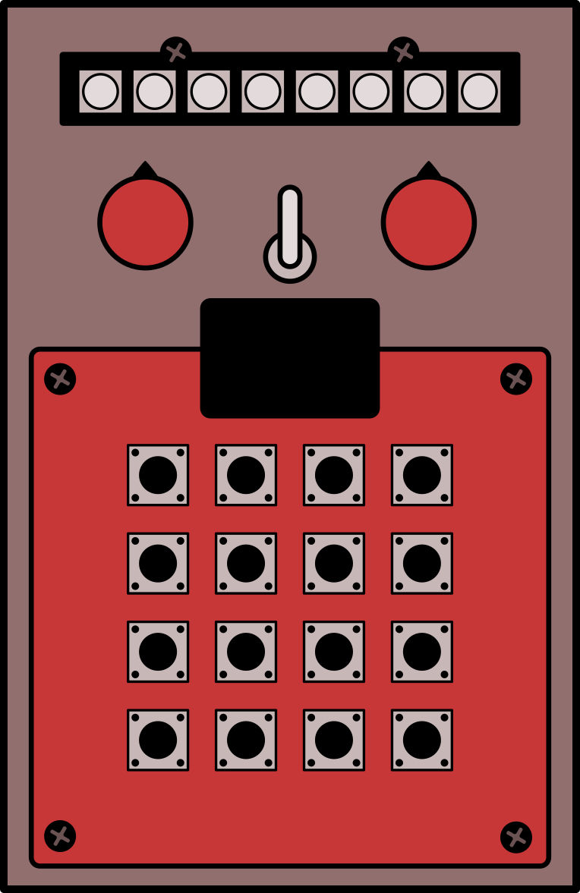

# [Polycule](https://kbsezginel.github.io/polycule)
DIY instruments and music things...

## [Moduled Nano LED synthesizer](https://kbsezginel.github.io/moduled-nano)
MIDI controlled modular LED synthesizer (8 hp).
Setup LED animations using MIDI data on your modular rack.

## [One-shot audio sampler](https://kbsezginel.github.io/polycule/one-shot)
Arduino one-shot audio sampler &amp; mp3 player

## PO-24 Cheat Sheet

