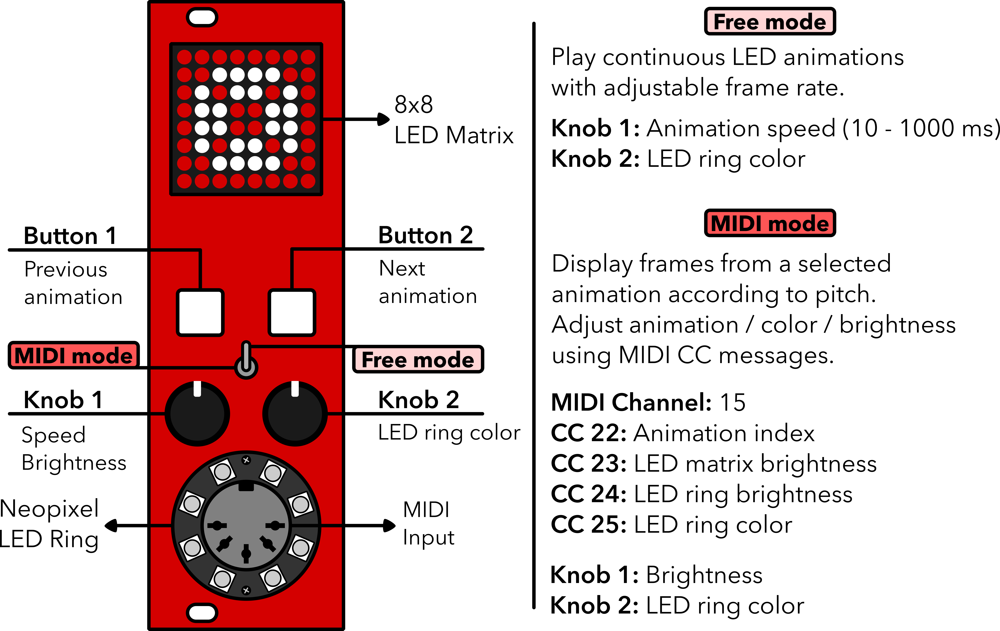

# Moduled Nano
MIDI controlled modular LED synthesizer (8 hp).
Setup LED animations using MIDI data on your modular rack.

<p align="center"></p>

## DIY

## Hardware

### What you need
- 1x Arduino Nano
- 1x 8x8 LED matrix
- 1x Neopixel LED ring (8 LEDs)
- 1x MIDI female jack
- 2x buttons
- 1x 2-way toggle switch
- 2x 10K Potentiometers
- 2x 220 ohm resistor
- 1x 4.7k resistor
- 3x 10k resistor
- 1x 1N914 diode
- 1x 6N138 Optocoupler
- Protoboard, wires, soldering iron

### Case
I designed the case using `Blender` 3D rendering software and exported an `stl` file and printed the case using Lulzbot TAZ 6 3D printer. The `.blend` and `stl` file for the case can be found [here](https://github.com/kbsezginel/polycule/tree/master/moduled).

## Software

### moduled_nano.ino
[Moduled Nano Arduino script.](https://github.com/kbsezginel/polycule/blob/master/moduled/moduled_nano.ino)

### Setting up custom LED animations
Using this [online LED matrix editor](https://xantorohara.github.io/led-matrix-editor/) you can setup a sequence of images to be added as an animation.

## Usage
<p align="center"></p>

## Shapes
8x8 LED matrix shapes that change size

### [Empty circles | 4 sizes](https://xantorohara.github.io/led-matrix-editor/#0000001818000000|0000182424180000|003c424242423c00|3c4281818181423c)
```
const uint64_t IMAGES[] = {
  0x0000001818000000,
  0x0000182424180000,
  0x003c424242423c00,
  0x3c4281818181423c
};
```

### [Filled circles | 4 sizes](https://xantorohara.github.io/led-matrix-editor/#0000001818000000|0000183c3c180000|003c7e7e7e7e3c00|3c7effffffff7e3c)
```
const uint64_t IMAGES[] = {
  0x0000001818000000,
  0x0000183c3c180000,
  0x003c7e7e7e7e3c00,
  0x3c7effffffff7e3c
};
```

### [Diagonal lines (symmetric) | 4 sizes](https://xantorohara.github.io/led-matrix-editor/#4080000000000102|50a040800102050a|54a851a2458a152a|55aa55aa55aa55aa)
```
const uint64_t IMAGES[] = {
  0x4080000000000102,
  0x50a040800102050a,
  0x54a851a2458a152a,
  0x55aa55aa55aa55aa
};
```

### [Diagonal lines (non-symmetric) | 7 sizes](https://xantorohara.github.io/led-matrix-editor/#4080000000000000|50a0408000000000|54a850a040800000|55aa54a850a04080|55aa55aa54a850a0|55aa55aa55aa54a8|55aa55aa55aa55aa)

```
const uint64_t IMAGES[] = {
  0x4080000000000000,
  0x50a0408000000000,
  0x54a850a040800000,
  0x55aa54a850a04080,
  0x55aa55aa54a850a0,
  0x55aa55aa55aa54a8,
  0x55aa55aa55aa55aa
};
```

## Animations

#### [Circling box](https://xantorohara.github.io/led-matrix-editor/#0100000000000000|0101000000000000|0101010000000000|0101010100000000|0101010101000000|0101010101010000|0101010101010100|0101010101010101|0101010101010103|0101010101010107|010101010101010f|010101010101011f|010101010101013f|010101010101017f|01010101010101ff|01010101010181ff|01010101018181ff|01010101818181ff|01010181818181ff|01018181818181ff|01818181818181ff|81818181818181ff|c1818181818181ff|e1818181818181ff|f1818181818181ff|f9818181818181ff|fd818181818181ff|ff818181818181ff)

```
const uint64_t IMAGES[] = {
  0x0100000000000000,
  0x0101000000000000,
  0x0101010000000000,
  0x0101010100000000,
  0x0101010101000000,
  0x0101010101010000,
  0x0101010101010100,
  0x0101010101010101,
  0x0101010101010103,
  0x0101010101010107,
  0x010101010101010f,
  0x010101010101011f,
  0x010101010101013f,
  0x010101010101017f,
  0x01010101010101ff,
  0x01010101010181ff,
  0x01010101018181ff,
  0x01010101818181ff,
  0x01010181818181ff,
  0x01018181818181ff,
  0x01818181818181ff,
  0x81818181818181ff,
  0xc1818181818181ff,
  0xe1818181818181ff,
  0xf1818181818181ff,
  0xf9818181818181ff,
  0xfd818181818181ff,
  0xff818181818181ff
};
```

### [Pharmacy | 16 images](https://xantorohara.github.io/led-matrix-editor/#0000001818000000|0000182424180000|0018186666181800|181818e7e7181818|991818e7e7181899|dbdb18e7e718dbdb|ffffffe7e7ffffff|ffffffffffffffff|ffffffffffffffff|ffffffe7e7ffffff|dbdb18e7e718dbdb|991818e7e7181899|181818e7e7181818|0018186666181800|0000182424180000|0000001818000000)

```
const uint64_t IMAGES[] = {
  0x0000001818000000,
  0x0000182424180000,
  0x0018186666181800,
  0x181818e7e7181818,
  0x991818e7e7181899,
  0xdbdb18e7e718dbdb,
  0xffffffe7e7ffffff,
  0xffffffffffffffff,
  0xffffffffffffffff,
  0xffffffe7e7ffffff,
  0xdbdb18e7e718dbdb,
  0x991818e7e7181899,
  0x181818e7e7181818,
  0x0018186666181800,
  0x0000182424180000,
  0x0000001818000000
};
```

### [Filling circles | 11 images](https://xantorohara.github.io/led-matrix-editor/#0000001818000000|0000182424180000|003c424242423c00|7e8181818181817e|7e8181999981817e|7e8181999981817e|7e8199a5a599817e|7ebdc3c3c3c3bd7e|7ebdc3dbdbc3bd7e|7ebddbe7e7dbbd7e|7ebddbffffdbbd7e)

```
const uint64_t IMAGES[] = {
  0x0000001818000000,
  0x0000182424180000,
  0x003c424242423c00,
  0x7e8181818181817e,
  0x7e8181999981817e,
  0x7e8181999981817e,
  0x7e8199a5a599817e,
  0x7ebdc3c3c3c3bd7e,
  0x7ebdc3dbdbc3bd7e,
  0x7ebddbe7e7dbbd7e,
  0x7ebddbffffdbbd7e
};
```
