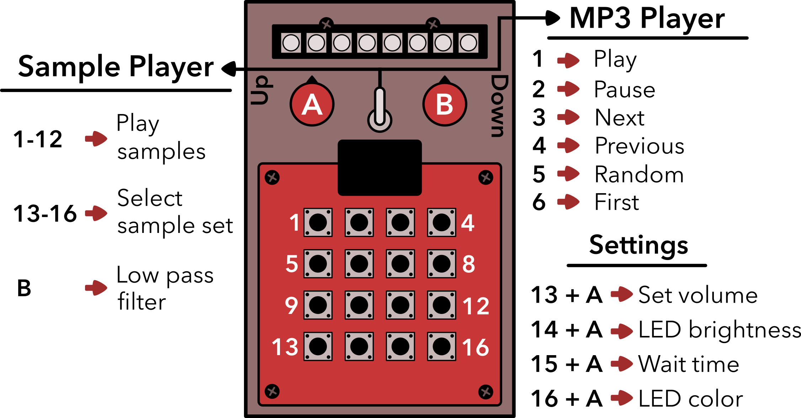

# One-shot
One-shot audio playback and MP3 player device

## DIY

### What you need
- Arduino Uno
- DFPlayer mini ()
- LEDs (I use a 8 LED Neopixel strip)
- 4x4 Keypad
- One 3-way toggle switch
- 2 10K Potentiometers

## Software

### Polycule.ino
[Polycule Arduino script.](https://github.com/kbsezginel/polycule/blob/master/scripts/polycule.ino)

### Sample organizer
[Organize and convert samples to mp3 (Linux).](https://github.com/kbsezginel/polycule/tree/master/scripts/organize_samples)

## Usage

One-shot has two modes:
- Sample player
- MP3 player

The modes can be selected using the switch.

### Sample Player Mode

- Buttons 1-12 play samples
- Buttons 13-16 select sample sets
- Pot B is a low pas filter

### MP3 Player Mode

- Button 1 -> Play
- Button 2 -> Pause
- Button 3 -> Next song
- Button 4 -> Previous song
- Button 5 -> Random song
- Button 6 -> First song

#### Settings

- Button 13 & Pot A -> Set volume
- Button 14 & Pot A -> LED brightness
- Button 15 & Pot A -> Wait time
- Button 16 & Pot A-> LED color
